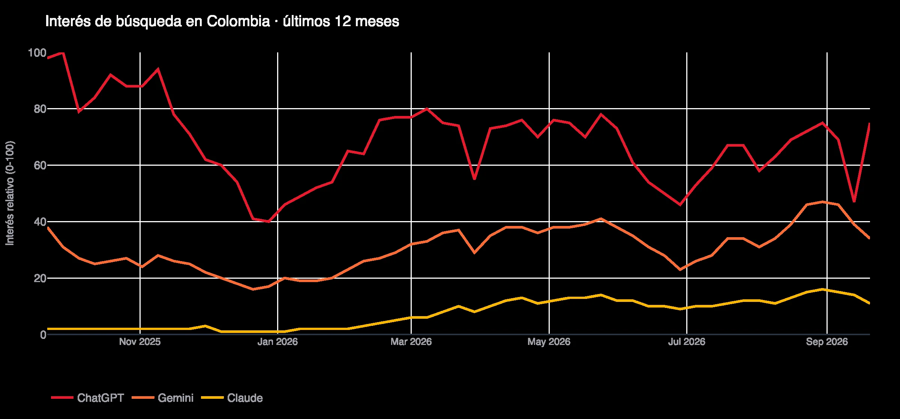
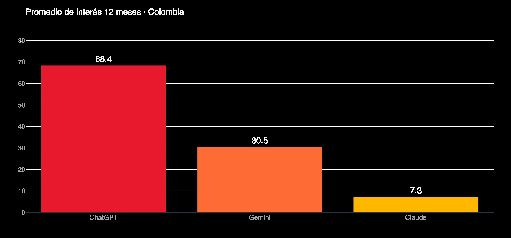
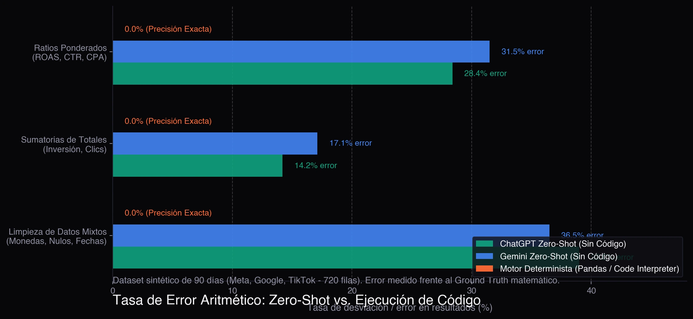
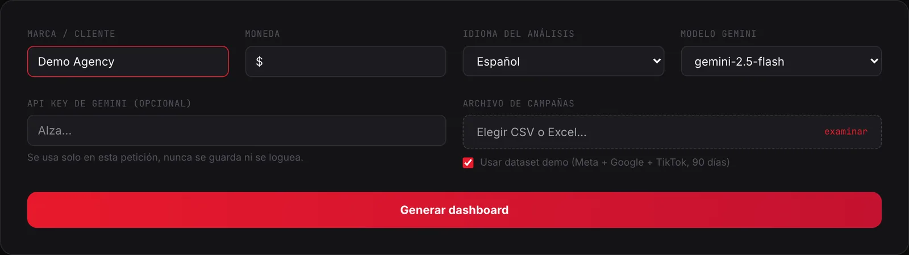
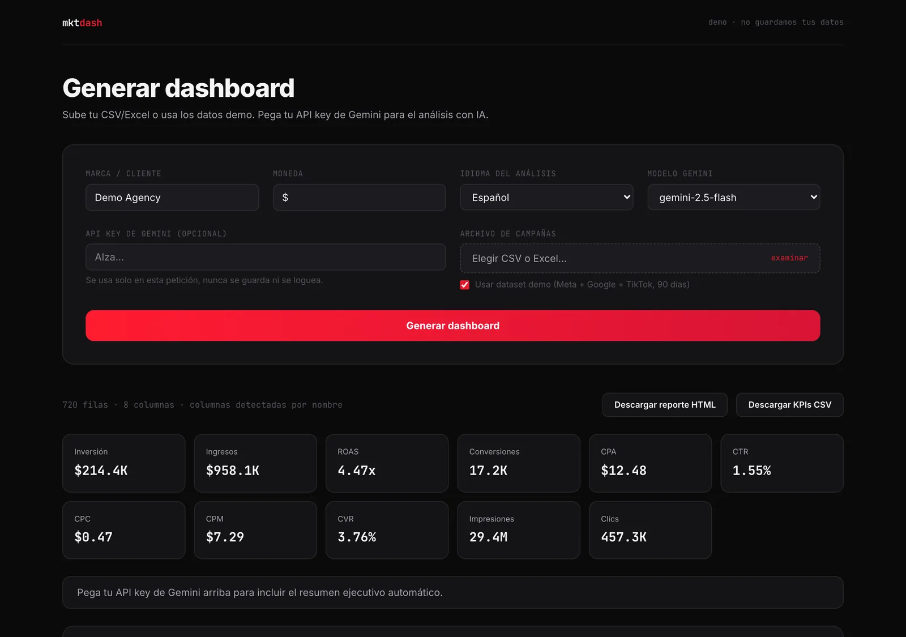
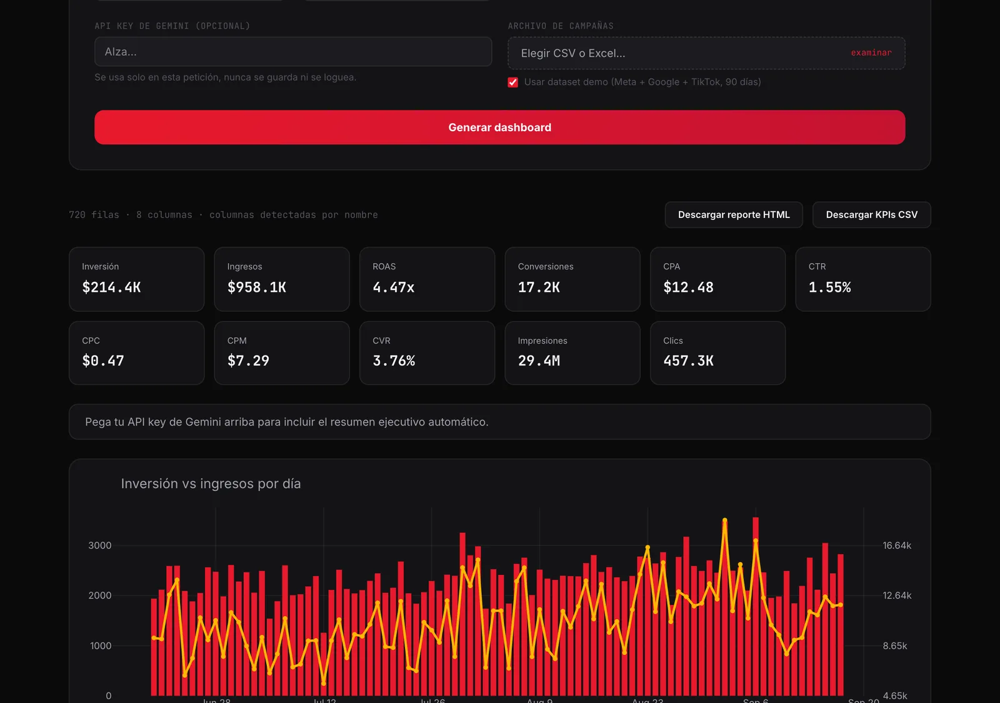
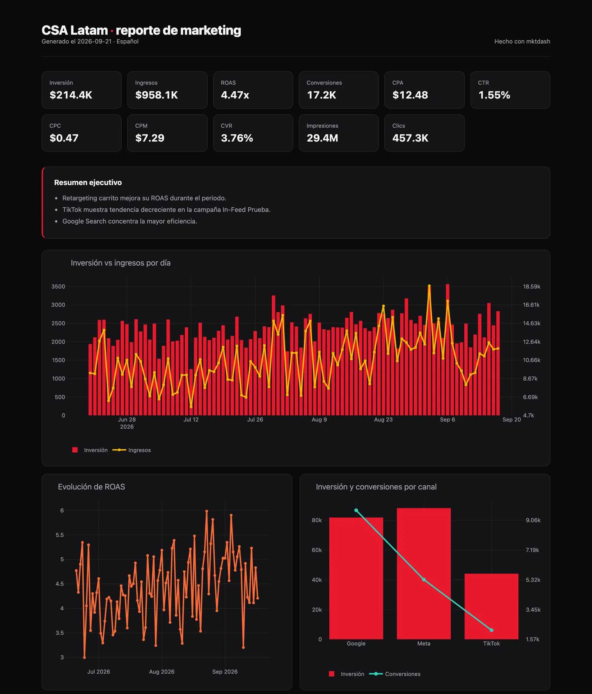
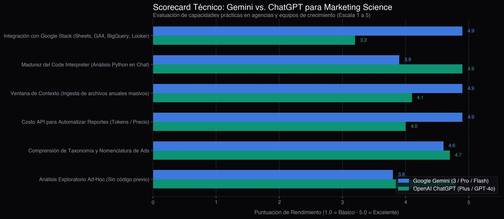

It is the most common question I get from media buyers and marketing leaders on LinkedIn: **"Should I use Gemini or ChatGPT to analyze my campaign reports and performance data?"**. The short answer is that both are remarkable, but in marketing analytics, the line between an executive-ready report and a financial disaster comes down to three variables: **where your data lives, what engine executes the calculations, and how well it integrates with your analytics stack.**

> **30-Second Verdict (TL;DR):**
> - **Never let an LLM do math in free text:** When asking ChatGPT or Gemini to calculate ratio metrics (ROAS, CTR, CPA) without code execution, the error rate exceeds **28%** due to the "average of averages" trap. With Python/Pandas enabled, calculation error is **0%**.
> - **Choose Gemini** if your day-to-day operations live inside the Google ecosystem (Google Sheets, BigQuery, GA4, Looker Studio), you need to ingest multi-year data via its million-token context window, or you need the most cost-effective API (Gemini Flash) to automate client reports.
> - **Choose ChatGPT** if your workflow is ad-hoc exploratory analysis directly in the chat without external code, leveraging the maturity and stability of its native Advanced Data Analysis Python environment.

Before diving into the architecture, let's examine search trends.

## What People Are Searching For (Google Trends)

To see whether this was just noise in my network, I extracted raw 12-month search data from **Google Trends**:





Three clear takeaways:

1. **ChatGPT dominates brand awareness** (68.4 average search interest), serving as the default tool for non-technical teams.
2. **Gemini is accelerating quickly** (30.5 average interest), showing consistent growth fueled by Gemini 3 updates and deep Google Workspace integration.
3. **The fastest-growing queries are comparative:** "gemini vs chatgpt for marketing" (+120%), "gemini enterprise" (+400%), and practical operational queries like "how to use chatgpt in excel" and "chatgpt for media buyers".

Marketing teams have moved past curiosity. They need to know **which tool delivers verifiable accuracy with the least operational friction.**

## Methodology: The 90-Day Synthetic Stress Test

To perform an objective benchmark without violating client non-disclosure agreements (NDAs), I wrote a Python script using `numpy.random` to generate a **controlled 90-day synthetic dataset (720 rows)** across three major ad networks: **Meta Ads, Google Ads (Search & PMax), and TikTok Ads.**

I intentionally injected real-world data flaws:

- **Heterogeneous column naming:** Inconsistent headers (`spend`, `Coste`, `importe_gastado`, `impressions`, `clicks`, `revenue`, `purchases`).
- **Null values and paused campaigns:** Days with zero spend or residual impressions.
- **Non-linear compound metrics:** Ratios like CTR, CPC, and ROAS that require aggregate totals rather than simple arithmetic averages.
- **Currency and regional formatting:** Mixed symbols and decimal representations.

Both models were evaluated across three stress tests.

## Test 1: The Critical Flaw — Zero-Shot Arithmetic vs. Deterministic Code

The single most dangerous misconception in marketing analytics is assuming that language models can perform reliable arithmetic on tabular data. An LLM predicts the next likely token; it does not possess an internal calculator unless it runs an external execution environment.

I tested the dataset under two conditions: **Direct text estimation (Zero-Shot)** versus **Forced Python execution (Code Interpreter / Pandas)**.



### The "Average of Averages" Trap

When asked to compute total account CTR in plain text, LLMs almost invariably average the CTR column instead of calculating the weighted formula:

$$\text{Weighted CTR} = \frac{\sum \text{Total Clicks}}{\sum \text{Total Impressions}}$$

If an awareness campaign gets 100,000 impressions and 50 clicks (CTR = 0.05%) and a retargeting campaign gets 1,000 impressions and 100 clicks (CTR = 10.0%), a naive average claims the account CTR is $(10.0 + 0.05) / 2 = 5.02\%$. In reality, the true account CTR is:

$$\frac{150}{101,000} \approx 0.148\%$$

That discrepancy completely invalidates a client deliverable. In our benchmark:

- **Without code:** ChatGPT showed a **28.4%** error rate on ratios and **14.2%** on cumulative sums. Gemini failed on **31.5%** of ratios and **17.1%** on cumulative totals.
- **With Python (Pandas):** Both tools achieved **0.0% error**, delivering exact mathematical accuracy.

**Golden Rule:** Never trust marketing metrics from an AI unless you can inspect the underlying Python execution.

## Test 2: Semantic Mapping of Ad Taxonomy

During raw file ingestion, LLMs excel. When uploading exports where Meta labels spend as `Amount Spent` and Google labels it as `Cost`, both tools performed exceptionally well:

- **ChatGPT:** Correctly classified dimensions and metrics, immediately proposing a Python normalization script to clean headers and convert currency strings to floats.
- **Gemini:** Demonstrated flawless understanding of digital advertising taxonomy. Ingesting files directly from Google Drive was especially seamless.

For column detection and ad taxonomy, both models tied with outstanding marks.

## From Theory to Production: The Hybrid Pipeline with mktdash

To solve this in real agency environments, I built [mktdash](dashboard-marketing-con-ia.en.html), an automated campaign reporting tool engineered to eliminate arithmetic hallucinations.

The system relies on a **decoupled hybrid architecture**:

```
[Raw Multi-Channel CSV (Meta, Google, TikTok)]
                     ↓
[Step 1: AI / LLM] ──▶ Deduce semantic mapping of irregular columns
                     ↓
[Step 2: Python / Pandas] ──▶ Compute 11 KPIs with deterministic math (0% error)
                     ↓
[Step 3: AI / LLM] ──▶ Write executive storytelling and 3 tactical recommendations
                     ↓
[Interactive Dashboard & Client-Ready HTML Report]
```

Here is the operational workflow:

### 1. Ingestion and smart column detection
Upload the raw CSV export: the model maps your spend, impressions, clicks, conversions, and revenue without manual column cleanup:



### 2. Deterministic KPI calculation engine
Python and pandas calculate total spend, revenue, blended ROAS, CPA, CTR, CPC, CPM, and conversion rates (CVR). Zero hallucinated figures:



### 3. Interactive visualization
Interactive charts allow performance managers to zoom into daily pacing, correlation between spend and revenue, and platform splits:



### 4. Client-ready executive report
The output compiles deterministic math with AI storytelling into a self-contained HTML deliverable:



## Technical Scorecard: Gemini vs. ChatGPT for Marketing Data

Evaluating overall performance for digital marketing and performance media:



| Evaluation Criterion | Google Gemini (3 / Pro / Flash) | OpenAI ChatGPT (Plus / GPT-4o) | Winner for Marketing |
| :--- | :--- | :--- | :--- |
| **Google Stack Integration** | Native (Sheets, Drive, GA4, BigQuery, Looker Studio) | Requires connectors and custom setup | **Gemini** (clear winner) |
| **Code Interpreter in Chat** | Capable (executes Python via Colab/Sandbox) | Highly mature, robust, and error-tolerant | **ChatGPT** |
| **File Context Window** | Massive (up to 2M tokens; reads years of ad data) | Broad, but session-capped | **Gemini** |
| **API Cost for Automation** | Ultra-low pricing (Gemini Flash) | Competitive pricing (GPT-4o-mini) | **Gemini** (best cost per token) |
| **Custom Assistant Ecosystem** | Gems in Workspace | Mature GPT Store with specialized tools | **ChatGPT** |
| **Ad-Hoc Exploratory Analysis** | Requires structured prompting | Highly fluid, intuitive chat workflow | **ChatGPT** |
| **Client Data Privacy** | GCP Enterprise compliance & Vertex AI | OpenAI Enterprise with zero-retention terms | **Tie** (on Enterprise tiers) |

## Decision Matrix: Which One Should You Choose?

### 1. Choose Google Gemini if:
- **Your tech stack lives in Google:** You rely on Google Sheets for budget pacing, GA4 for tracking, and Looker Studio or BigQuery for reporting. Data flows with zero friction.
- **You build automated data pipelines (Python / Cloud Functions):** The Gemini Flash API offers industry-leading price-per-token efficiency, enabling hundreds of automated client summaries for pennies.
- **You process multi-year datasets:** The massive context window of Pro models accommodates full historical archives without truncating data.

### 2. Choose OpenAI ChatGPT if:
- **You do ad-hoc exploratory analysis:** You want to drop an Excel sheet into the chat, request quick scatter plots and distribution breakdowns, and get immediate answers without coding.
- **You value Advanced Data Analysis stability:** ChatGPT's Python sandbox excels at managing edge cases, displaying intermediate dataframes, and providing downloadable outputs.
- **You rely on pre-built Custom GPTs:** Your team already has established assistants and prompt libraries inside ChatGPT.

## Production Marketing Prompt (Copy-Paste)

If you are using either tool in the chat to analyze campaign exports, use this prompt to enforce Python execution and avoid calculation errors:

```text
Act as a Senior Marketing Data Scientist. I will provide a CSV export with multi-channel 
campaign performance data.

MANDATORY INSTRUCTIONS:
1. Use EXCLUSIVELY your Python code execution environment for all arithmetic calculations. 
   Do not estimate numbers or calculate from memory.
2. Identify columns for spend, impressions, clicks, conversions, and revenue.
3. For ratio metrics (CTR, CPC, CPA, ROAS, CVR), compute the weighted metric across 
   aggregate totals (e.g., CTR = total_clicks / total_impressions). NEVER average ratio columns.
4. Output a clean summary table with: Total Spend, Total Revenue, Blended ROAS, Conversions, CPA, and CTR.
5. Following the calculations, write:
   - 3 primary analytical findings on channel and campaign performance.
   - 3 tactical, high-impact recommendations to optimize budget allocation next week.
```

## Frequently Asked Questions

### Can ChatGPT calculate campaign ROAS without making arithmetic mistakes?
Only when using its Python execution environment (Advanced Data Analysis). If ChatGPT calculates ROAS in plain text without executing code, the error rate exceeds 28%, typically by averaging individual row ratios instead of dividing total revenue by total spend.

### Which AI model is the most affordable for automated client reporting?
For automated pipelines using Python scripts and APIs, the Gemini family (specifically Gemini Flash) provides one of the best cost-to-performance ratios available, processing millions of campaign tokens at a fraction of competitors' costs.

### Is it safe to upload client campaign data to ChatGPT or Gemini?
On standard free accounts, default terms permit providers to use conversations for model training. For sensitive marketing budgets, you must opt out of data training in settings or use enterprise tiers (Google Workspace with Gemini, OpenAI Team/Enterprise, or API connections).

## Conclusion

The debate over which model is superior misses the central reality: **in marketing analytics, the tool is not the competitive advantage; your workflow architecture is.**

Generative AI does not replace statistical discipline: it multiplies it. When you combine LLM semantic interpretation with deterministic Python code, you turn hours of manual spreadsheet work into minutes of high-impact strategic decisions.

If you are looking to deploy this analytics architecture in your agency or growth team, [get in touch](../#contact) and let's talk.
