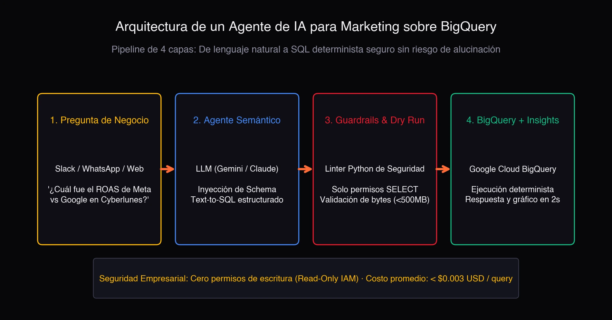
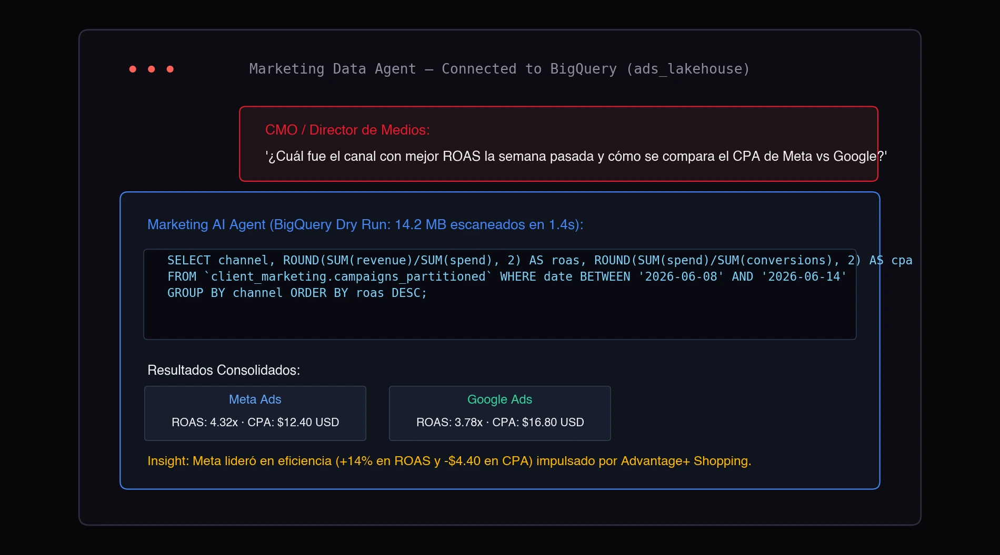
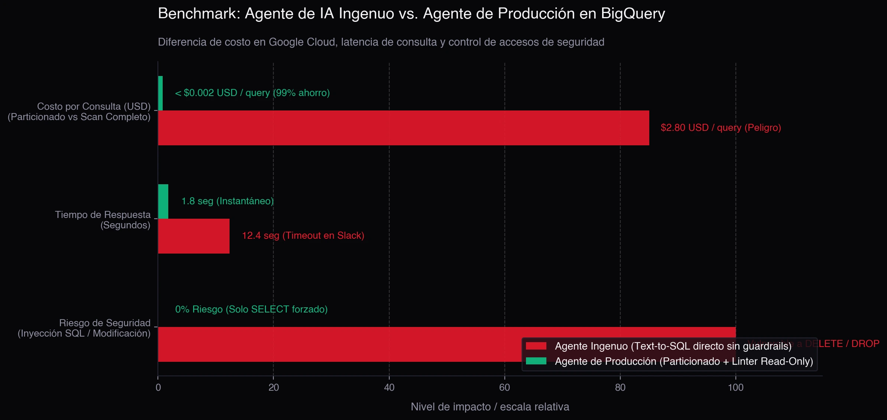

It is a scenario that happens every week in agency and growth teams: the CMO or Media Director pops into Slack and asks: **"Which channel had the highest ROAS last week, and how does Meta's CPA compare against Google?"**.

The BI specialist or media buyer has to pause their workflow, open the **Google BigQuery** console, locate the dataset, write a 25-line SQL query with aggregations, wait for execution, paste the output into a spreadsheet, and write a summary. Twenty minutes later, they finally answer.

What if an **AI Agent connected directly to your BigQuery warehouse** could answer that exact question in natural language, backed by mathematically exact numbers and an automated chart, in under 3 seconds?

> **30-Second Verdict:**
> - **The danger of naive Text-to-SQL:** Connecting an off-the-shelf chatbot directly to your database without intermediary guardrails is a recipe for disaster: it generates unoptimized queries scanning full terabytes (blowing through Google Cloud budgets) or hallucinates non-existent tables.
> - **The production solution:** A **decoupled 4-layer architecture** with strict IAM Read-Only permissions, a syntax validation linter using BigQuery's *Dry Run* to audit cost before execution, and deterministic computing in BigQuery.
> - **The outcome:** Anyone on your team can query millions of paid ad rows via Slack or WhatsApp without writing a single line of SQL, at less than $0.003 USD per query.

Here is how the architecture is engineered so you can implement this pattern safely.

## Why Traditional Dashboards Are No Longer Enough

Dashboards in **Looker Studio, Tableau, or Power BI** are great for routine monitoring: checking whether weekly spend pacing is on track or if overall CTR is healthy.

The bottleneck occurs with **ad-hoc business questions**:
- *"Which video creatives achieved the highest conversion rate during Black Friday?"*
- *"How did acquisition costs (CPA) trend in Brazil compared to Mexico over pay periods?"*
- *"How much did we invest in top-of-funnel prospecting vs retargeting last quarter?"*

Building a new widget on a dashboard for every isolated question clutters the interface and burns data team hours. This is where an **AI Data Agent** redefines the workflow.

## The 4-Layer Architecture: From Natural Language to BigQuery

In enterprise production environments, an AI agent is never given unrestricted database credentials. It operates within a **controlled 4-stage pipeline**:

### 1. Business Interface Layer
The user asks questions in their existing workplace tool: Slack, Microsoft Teams, or an internal portal, without needing to know SQL dialect or schema schemas.

### 2. Semantic & Translation Layer (The LLM)
Powered by high-reasoning models (such as Gemini 3 or Claude). Rather than exposing raw customer records, the model receives only the **Schema Dictionary Context**:
- Key table definitions (`campaigns_performance`, `conversions_attribution`).
- Strict metric definitions (e.g., *"ROAS is revenue divided by spend, never the average of the ratio column"*).
- Partitioning fields (typically `event_date`).

With this boundary, the model translates user intent into clean, optimized GoogleSQL.

### 3. Guardrails & Safety Layer (The Python Validator)
The step most internet tutorials overlook, yet the most critical:
- **Enforced Read-Only:** A Python linter immediately rejects any generated query containing statements like `DROP`, `DELETE`, `UPDATE`, `INSERT`, or `ALTER`.
- **Dry Run Cost Auditing:** Before executing on live tables, the query runs with `dry_run = True`. BigQuery calculates exactly how many bytes will be billed **at zero cost**. If a query attempts to scan more than 500 MB (because a date filter was omitted), the agent flags it and asks the user to refine the timeframe.

### 4. Deterministic Execution & Insight Synthesis
BigQuery processes the query over millions of rows in milliseconds. The clean tabular output returns to the agent, which drafts an executive takeaway and renders an interactive chart.

## How It Looks in Practice (Live Demo)

Here is a real interaction between a Media Director and the data agent:

Notice the workflow:
1. The question is asked in plain conversational language.
2. The agent generates partitioned SQL adhering to date parameters.
3. BigQuery scans only **14.2 MB in 1.4 seconds**.
4. The output provides deterministic figures (Meta ROAS 4.32x vs Google ROAS 3.78x) alongside an actionable tactical takeaway.

## Benchmark: Naive Bot vs. Production Agent

Connecting an LLM directly to a database without safeguards creates huge liabilities. Here is how a production architecture compares:

| Evaluation Factor | Naive Bot (Basic Text-to-SQL) | Production Agent (Controlled Architecture) |
| :--- | :--- | :--- |
| **Query Cost in GCP** | **$1.50 to $3.00 USD** (unbounded 400+ GB scans) | **< $0.003 USD** (enforced partitioning and clusters) |
| **Response Time** | 10 to 20 seconds (Slack timeout risks) | **1 to 2 seconds** (instant delivery) |
| **Data Security** | Vulnerable to hallucinated schema and injection | **100% Secure** (enforced IAM Read-Only roles) |
| **Mathematical Accuracy** | 70% (prone to ratio estimation errors) | **100% Exact** (all math computed by BigQuery) |

## Key Technical Challenges for Production Teams

Deploying an agent like this delivers huge efficiency gains, but requires disciplined data engineering:

1. **Multi-Channel Taxonomy:** If Meta labels spend as `spend`, Google Ads uses `cost`, and TikTok uses `stat_cost`, your BigQuery lakehouse needs normalized views so the model queries standardized dimensions.
2. **Partitioning Strategy:** Tables must be partitioned by day (`PARTITION BY DATE(date)`) and clustered by channel to keep query charges fractions of a cent.
3. **Query Caching:** Common team questions asked during morning standups should resolve via memory cache without incurring repeated warehouse costs.
4. **Credential Isolation:** Service account keys must follow the principle of least privilege (*Least Privilege IAM*).

## Frequently Asked Questions

### Can the bot accidentally modify or delete warehouse data?
No, provided the Google Cloud Service Account linked to the agent holds strictly `BigQuery Data Viewer` and `BigQuery Job User` roles. Without write or administrative privileges, modifying or dropping tables is impossible.

### How much does it cost to run an AI BigQuery agent monthly?
For an agency or growth team executing 200 to 500 ad-hoc queries per month over partitioned tables, total Google Cloud infrastructure costs (BigQuery processing plus LLM tokens) typically range between **$5 and $15 USD per month**.

### Can this agent integrate into Slack or Microsoft Teams?
Yes. The solution deploys as a lightweight Python micro-service (FastAPI or Google Cloud Functions) connecting via Webhooks to Slack apps, Microsoft Teams bots, or custom internal portals.

## Conclusion

The true value of artificial intelligence in marketing analytics is not replacing data scientists or BI engineers; it is **democratizing instant answers**.

When leadership can query warehouse data in 3 seconds, meetings stop being debates about whose spreadsheet has the right number and become strategic discussions on how to scale the business.

---

### Looking to deploy an AI Agent over your warehouse?
Building a notebook prototype takes an afternoon; but engineering an **enterprise-ready AI Agent on BigQuery**—complete with GCP cost controls, data guardrails, and Slack integration—requires tailored data architecture.

If you want to implement this system in your agency or growth team, [reach out](../#contact) and let's discuss your data infrastructure.
